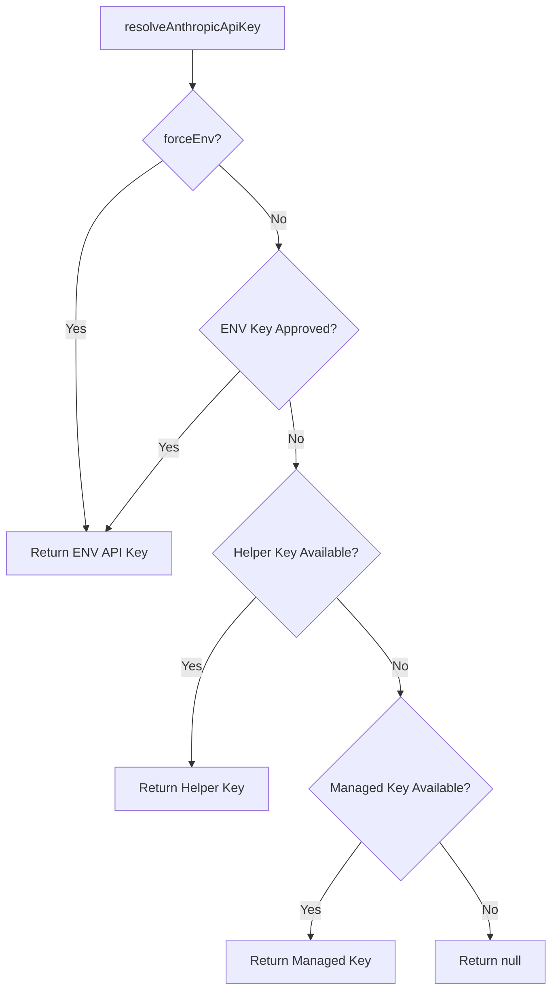
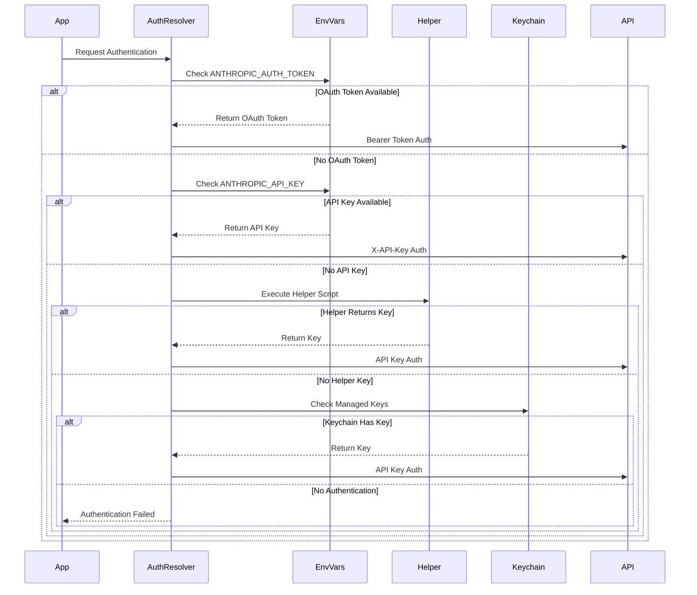
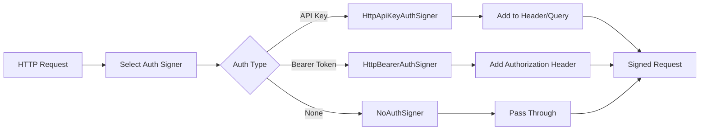

# Authentication Flow Documentation

## Overview

The authentication system extracted from the obfuscated JavaScript implements a multi-layered authentication architecture supporting various authentication methods for different services. The system is designed with flexibility, security, and fallback mechanisms in mind.

## Table of Contents

1. [Authentication Architecture](#authentication-architecture)
2. [HTTP Authentication Layer](#http-authentication-layer)
3. [Anthropic API Authentication](#anthropic-api-authentication)
4. [AWS Authentication](#aws-authentication)
5. [Session Management](#session-management)
6. [Proxy Authentication](#proxy-authentication)
7. [Authentication Flow Diagrams](#authentication-flow-diagrams)

## Authentication Architecture

The system implements three main authentication layers:

1. **Generic HTTP Authentication** - Provides base authentication signers
2. **Service-Specific Authentication** - Anthropic and AWS implementations
3. **Session & Client Management** - Maintains authentication state

### Core Components

- **Authentication Signers**: Classes that sign HTTP requests with credentials
- **Identity Providers**: Manage and provide authentication credentials
- **Session Managers**: Track authentication sessions and state
- **Client Managers**: Maintain authenticated client instances

## HTTP Authentication Layer

### Authentication Signers

The system provides three core authentication signers:

#### 1. HttpApiKeyAuthSigner
- **Purpose**: Signs requests with API keys
- **Locations**: Can place API key in header or query parameters
- **Features**:
  - Supports custom scheme prefixes (e.g., "Bearer", "API-Key")
  - Validates all required parameters before signing
  - Clones request to avoid mutation

**Flow**:
```
Request → Validate Parameters → Clone Request → Add API Key → Return Signed Request
```

#### 2. HttpBearerAuthSigner
- **Purpose**: Signs requests with Bearer tokens
- **Location**: Always adds to Authorization header
- **Format**: `Authorization: Bearer {token}`

**Flow**:
```
Request → Validate Token → Clone Request → Add Bearer Token → Return Signed Request
```

#### 3. NoAuthSigner
- **Purpose**: Pass-through for requests that don't need authentication
- **Use Case**: Public endpoints or pre-authenticated requests

### DefaultIdentityProviderConfig

Manages multiple authentication schemes:
- Maps scheme IDs to identity providers
- Allows dynamic provider retrieval
- Supports multiple authentication methods per application

## Anthropic API Authentication

### Authentication Priority Order

The Anthropic authentication system follows a strict priority order:

1. **OAuth Token** (highest priority)
   - Source: `ANTHROPIC_AUTH_TOKEN` environment variable
   - Uses Bearer authentication
   - Includes beta header for OAuth features

2. **Environment API Key**
   - Source: `ANTHROPIC_API_KEY` environment variable
   - Requires approval for custom keys
   - Uses x-api-key header

3. **API Key Helper**
   - Source: Custom script/command defined in configuration
   - Executes external helper to retrieve key
   - Fallback when environment variables unavailable

4. **Managed Keys**
   - Source: Platform-specific keychain (e.g., macOS Keychain)
   - Secure storage mechanism
   - Retrieved through system APIs

### Key Resolution Flow



### Authentication Headers Builder

The `buildAuthHeaders()` function determines which authentication method to use:

1. **OAuth Path**:
   - Checks `hasOAuthAccess()`
   - Retrieves OAuth token
   - Returns Bearer token with beta header

2. **API Key Path**:
   - Falls back when OAuth unavailable
   - Retrieves API key
   - Returns x-api-key header

### Custom Headers Support

- Reads from `ANTHROPIC_CUSTOM_HEADERS` environment variable
- Parses multi-line format: `Header-Name: Header-Value`
- Merges with authentication headers

### AnthropicClient Class

Initializes with multiple authentication options:
- Checks for browser environment (security feature)
- Configures base URL, timeouts, and retry logic
- Stores authentication credentials
- Sets up logging and fetch options

## AWS Authentication

### Authentication Features

The AWS authentication system tracks various features:

1. **Protocol Detection**
   - RPC v2 CBOR protocol support
   - Sets appropriate feature flags

2. **Retry Strategy**
   - Adaptive, Standard, or Legacy modes
   - Determines retry behavior based on strategy type

3. **Account ID Management**
   - Disabled, Preferred, or Required modes
   - Validates account ID in requests

4. **Identity Resolution**
   - Extracts identity from HTTP auth scheme
   - Tracks account ID resolution

### SSO Token Management

```
SSO Start URL → Generate Token Path → Read Token File → Parse JSON → Return Token
```

### Request Signing

AWS requests use regional signing:
1. Check for explicit signing region
2. Extract region from FIPS endpoint if applicable
3. Apply regex pattern matching for region extraction

### Checksum Support

Supports multiple checksum algorithms:
- SHA256 (preferred)
- MD5 (legacy support)
- CRC32/CRC32C
- Dynamic algorithm addition

## Session Management

### Session Lifecycle

1. **Creation** (`makeSession`)
   - Generates unique session ID (UUID)
   - Sets initial timestamp
   - Initializes status as "ok"
   - Configures duration tracking

2. **Updates** (`updateSession`)
   - Tracks user information (ID, email, IP)
   - Updates timestamps and duration
   - Manages error counts
   - Sets environment information

3. **Closure** (`closeSession`)
   - Sets final status ("exited" or custom)
   - Calculates final duration
   - Preserves session data

### Session Data Structure

```javascript
{
  sid: "uuid-v4",              // Session ID
  init: true,                  // Initial session flag
  timestamp: 1234567890,        // Current timestamp
  started: 1234567890,          // Start timestamp
  duration: 0,                  // Session duration
  status: "ok",                 // Current status
  errors: 0,                    // Error count
  did: "user-id",              // User identifier
  ipAddress: "192.168.1.1",    // Client IP
  userAgent: "...",            // User agent string
  release: "1.0.0",            // App version
  environment: "production"     // Environment
}
```

## Proxy Authentication

### Basic Authentication Flow

1. Parse proxy URL for credentials
2. Extract username and password
3. Decode URI components
4. Create Basic auth string: `username:password`
5. Base64 encode credentials
6. Add header: `Proxy-Authorization: Basic {encoded}`

## Authentication Flow Diagrams

### Main Authentication Flow



### Request Signing Flow



## Security Considerations

1. **Browser Environment Protection**
   - Blocks authentication in browser by default
   - Requires explicit opt-in with `dangerouslyAllowBrowser`
   - Prevents credential exposure

2. **API Key Truncation**
   - Truncates keys for display (last 20 chars)
   - Prevents full key exposure in logs

3. **Environment Variable Priority**
   - OAuth tokens take precedence over API keys
   - Reduces risk of key exposure

4. **Request Cloning**
   - All signers clone requests before modification
   - Prevents mutation of original request objects

5. **Validation**
   - Strict parameter validation before signing
   - Clear error messages for missing credentials
   - Type checking for authentication data

## Error Handling

The system provides comprehensive error handling:

1. **Missing Credentials**
   - Clear error messages identifying missing parameters
   - Specific guidance on required fields

2. **Invalid Configuration**
   - Validates authentication schemes
   - Checks for proper signer configuration

3. **Fallback Mechanisms**
   - Multiple authentication sources
   - Graceful degradation
   - Returns null/error states instead of throwing

## Summary

The authentication system implements a sophisticated multi-service architecture with:
- **Flexibility**: Multiple authentication methods and sources
- **Security**: Environment protection, key truncation, validation
- **Reliability**: Fallback mechanisms and comprehensive error handling
- **Extensibility**: Pluggable signers and identity providers
- **State Management**: Session tracking and client management

The flow prioritizes security while maintaining usability through intelligent fallbacks and clear error messaging.